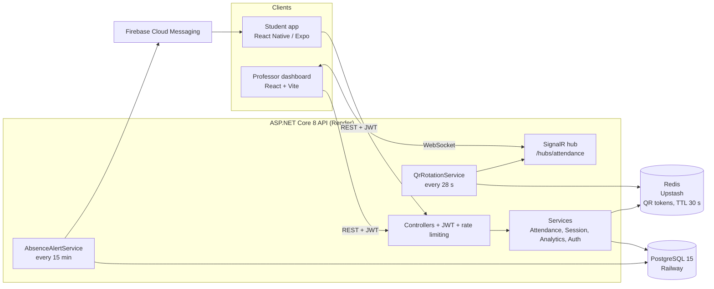
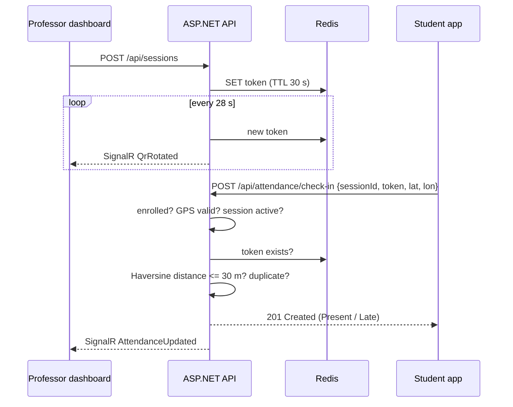
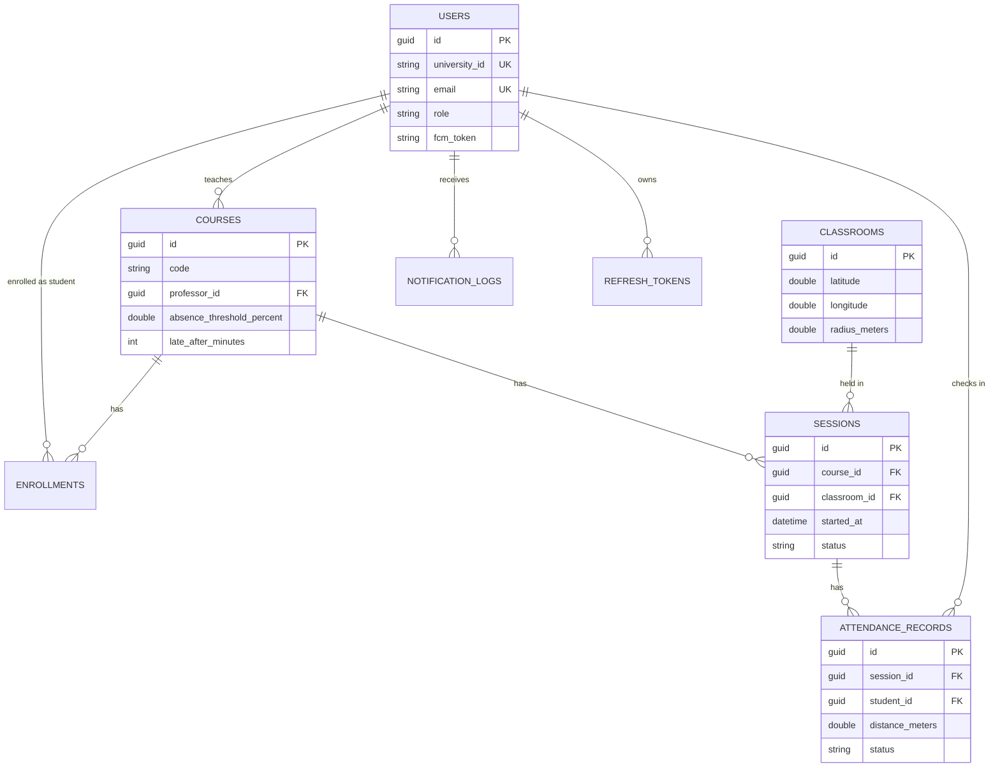

# Architecture

```mermaid
flowchart LR
  subgraph Clients
    M[Student app<br/>React Native / Expo]
    D[Professor dashboard<br/>React + Vite]
  end
  subgraph API["ASP.NET Core 8 API (Render)"]
    C[Controllers + JWT + rate limiting]
    S[Services<br/>Attendance, Session, Analytics, Auth]
    H[SignalR hub<br/>/hubs/attendance]
    B1[QrRotationService<br/>every 28 s]
    B2[AbsenceAlertService<br/>every 15 min]
  end
  PG[(PostgreSQL 15<br/>Railway)]
  R[(Redis<br/>Upstash<br/>QR tokens, TTL 30 s)]
  F[Firebase Cloud Messaging]
  M -- REST + JWT --> C
  D -- REST + JWT --> C
  D <-- WebSocket --> H
  C --> S --> PG
  S --> R
  B1 --> R
  B1 --> H
  B2 --> PG
  B2 --> F --> M
```

## Check-in sequence

```mermaid
sequenceDiagram
  participant P as Professor dashboard
  participant API as ASP.NET API
  participant R as Redis
  participant S as Student app
  P->>API: POST /api/sessions
  API->>R: SET token (TTL 30 s)
  loop every 28 s
    API->>R: new token
    API-->>P: SignalR QrRotated
  end
  S->>API: POST /api/attendance/check-in {sessionId, token, lat, lon}
  API->>API: enrolled? GPS valid? session active?
  API->>R: token exists?
  API->>API: Haversine distance <= 30 m? duplicate?
  API-->>S: 201 Created (Present / Late)
  API-->>P: SignalR AttendanceUpdated
```

## ER diagram

```mermaid
erDiagram
  USERS ||--o{ COURSES : teaches
  USERS ||--o{ ENROLLMENTS : "enrolled as student"
  COURSES ||--o{ ENROLLMENTS : has
  COURSES ||--o{ SESSIONS : has
  CLASSROOMS ||--o{ SESSIONS : "held in"
  SESSIONS ||--o{ ATTENDANCE_RECORDS : has
  USERS ||--o{ ATTENDANCE_RECORDS : "checks in"
  USERS ||--o{ NOTIFICATION_LOGS : receives
  USERS ||--o{ REFRESH_TOKENS : owns
  USERS { guid id PK
    string university_id UK
    string email UK
    string role
    string fcm_token }
  COURSES { guid id PK
    string code
    guid professor_id FK
    double absence_threshold_percent
    int late_after_minutes }
  CLASSROOMS { guid id PK
    double latitude
    double longitude
    double radius_meters }
  SESSIONS { guid id PK
    guid course_id FK
    guid classroom_id FK
    datetime started_at
    string status }
  ATTENDANCE_RECORDS { guid id PK
    guid session_id FK
    guid student_id FK
    double distance_meters
    string status }
```
`attendance_records (session_id, student_id)` and `enrollments (course_id, student_id)` are unique.
